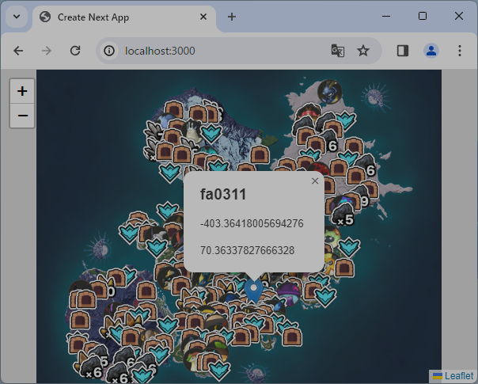

# PalWorld Map


<https://twitter.com/faa0311/status/1776296035306054110>

## Configuration

```sh
$ vi .env
```

## Setup

```sh
$ node -v
v18.19.1

$ npm -g i pnpm
$ pnpm i
$ pnpm run build
$ pnpm run start
```